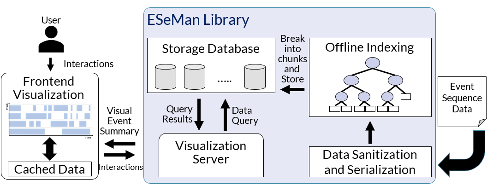

# ESeMan (Event SEquence MANager)

A hierarchical data management system to support querying of event sequence data for parallel timeline charts. It utilizes KD-Tree and agglomorative clustering to store event sequences. It can generate event summaries in varying accuracy levels. The accuracy can be controlled using the `pixel window` parameter (default 1 pixel).

### Prerequisite

This C++ program uses
- [boost](https://www.boost.org/) for faster data handling
- [Boost.Beast](https://github.com/boostorg/beast) for serving data over http using REST API.
- [LMDB](http://www.lmdb.tech/doc/) for fast key-value storage.

Additionally, ESeMan uses the following libraries as a submodule
- [RapidJSON](https://rapidjson.org/) for json handling.
- [hclust](https://github.com/cdalitz/hclust-cpp) for basic agglomerative clustering implementation.

Clone with the submodules using the following command,
```
git clone --recursive https://github.com/sayefsakin/eseman.git
```

Execute [install_dependencies.sh](install_dependencies.sh) to install the prerequisite libraries.
```
source install_dependencies.sh
```

### Input File
ESeMan now only takes input file in JSON format. Also, update the following parameters in the [config.json](config.json) file,

- `database_location`: LMDB database location
- `database_name`: LMDB database folder name, usually assign the json file name on this parameter.

### Build and Run

```
cd eseman
make
./eseman_data_server -h
```

### Bundle

To index the data within LMDB, the input file needs to be bundled using the following command.

```
./eseman_data_server -b -i input_file/<file_name>.json
```

*Warning: the bundling process can take longer based on the input file size.*

### Running the Server

To serve the bundled data over http, start the boost.beast server using the following command,

```
./eseman_data_server -s
```

### Available API Endpoints

```
Available endpoints (GET only):
  GET /get-data-in-range?
                         begin=(integer)&
                           end=(integer)&
                        tracks=(string)&
                          bins=(string)&
                     primitive=(string)
```

#### get-data-in-range

Calling the eseman api with [http://127.0.0.1:8080/get-data-in-range?bins=10](http://127.0.0.1:8080/get-data-in-range?bins=10) will give the following result in JSON format,

```
{
  "data": [
    {
      "track": "1",
      "utils": [
        "0.500000",
        .
        .
        .
        "0.500000"
      ]
    },
    {
      "track": "2",
      "utils": [
        "0.000000",
        .
        .
        .
        "0.500000"
      ]
    },
    .
    .
    .
  ],
  "metadata": {
    "begin": 36546573,
    "end": 372949710,
    "bins": 10
  }
}
```

Here, `bins` is the chart width in number of pixels.

### Architecture


This figure presents ESeMan works. ESeMan provides support for low latency interactions in parallel timeline charts through fast querying. It ingests and cleans event sequence data, building indices on the events and then serving summarized events to match data queries. These summarized events provide pixel accuracy with less data sent. Stronger summarization can trade accuracy for latency.

